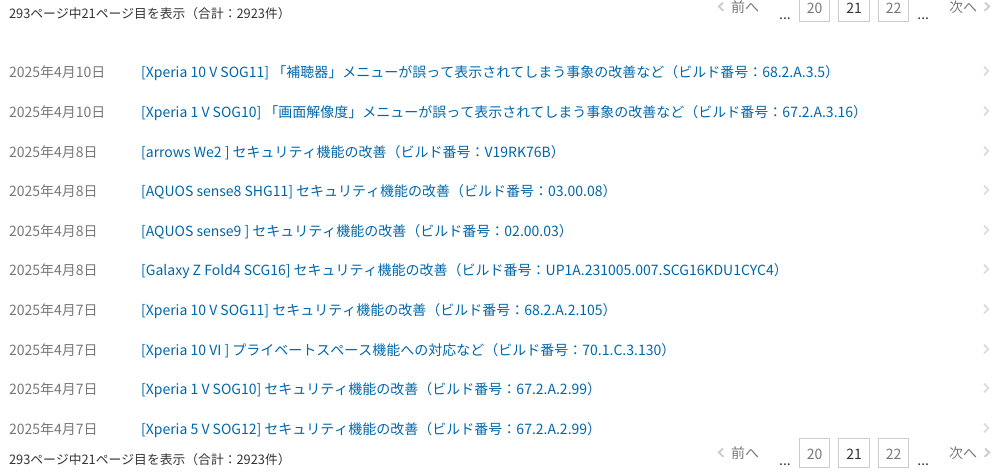
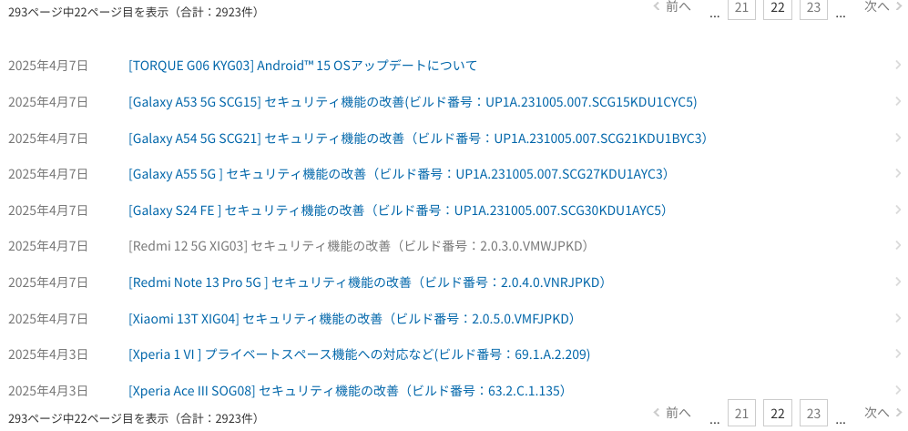
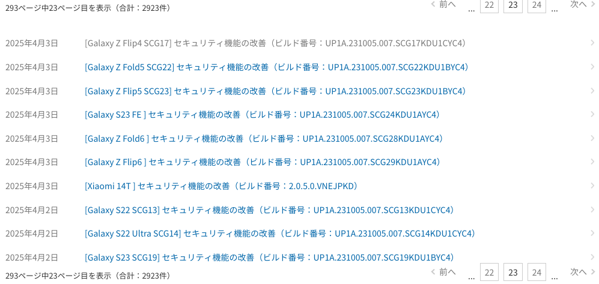

# au Starlink Directの27ヶ月間振り返り

こんにちは。本エントリは「au Starlink DirectでDTC」アドベントカレンダー2025の3日目の記事です。
昨日は [au Starlink Directのつながりやすさを爆発的に上げた軌道傾斜角43度の衛星追加](https://github.com/muojp/ac2025/blob/main/02.md) でした。

昨日の記事で

> 実は安定したフル機能のサービスがスタートしたのは11月末と言って良い状況です。

と言及しました。本稿の著者はiOSに関してあまり追っていないので分かりませんが、Androidでの各種対応状況が安定してきたのは2025年11月末頃です。

au（KDDI）公式の主要マイルストーンは4月のau Starlink Directサービス開始と8月末のデータ通信対応です。
特に衛星データ通信対応はauが世界初で、最先端機能を世界に先駆けて導入したがゆえの苦労がうかがえます。
しかしこれらの2回のタイミング以外でもサービス機能・サービスカバレッジの両面で地道で重要なアップデートが繰り返されてきました。

衛星データ通信については次回以降にじっくり紹介します。今回は「au Starlink Directの27ヶ月間」として各種サービスや情報アップデートを振り返ってみます。
この期間、本稿の著者はau Starlink Directについてなるべく丁寧に情報をチェックしていたのですが、追いかけきれないほど目まぐるしく状況が変わっていった時期もあったので備忘がてらのメモでもあります。

## au Starlink Directの現状（Android）

各種アップデート振り返りと言いつつ、時系列だけ追っても「結局au Starlink Directって今はどういうサービスで、なにができるの？」という筋が複雑で分かりにくくなるので、先に本稿執筆時点の現状を整理しておきます。

### できること

- 「Message」アプリでSMS/RCSを送受信できる
  - Android 15の「au Starlink Direct対応端末」すべてで使える
- 「Message」アプリで写真添付メッセージを送受信できる
  - Android 15の「au Starlink Direct対応端末」の大半の端末で使える
    - SMS/RCS対応機種を全体とした場合に8割ほどで使える
  - Pixel 8aとかは地味に対応外
- 衛星経由でアプリのデータ通信ができる
  - Android 16へアップデート済みの「au Starlink Direct対応端末」で使える
    - SMS/RCS対応機種を全体とした場合に6割程度が該当
  - Androidの全アプリではなく、衛星対応をmanifestで明示した対応アプリでデータ通信が可能
  - ざっくり使えるアプリ
    - X使える
    - YAMAPやヤマレコを使える
    - Google Mapsを使える
    - 天気予報を使える
    - 衛星経由での配信を明示的に有効化したFCMのプッシュ通知も届く

### できないこと

- 音声通話はできない
- manifestで衛星データ通信対応を明示していないすべてのアプリが衛星（DTC）環境では通信できない
  - 代表的なのはWebブラウザやLINE

### 誰が使えるの

- au回線契約者
  - お好みのプランで契約
- 「au Starlink Direct専用プラン+」契約者
  - 料金
    - 月1,650円で使える
    - UQ mobileユーザーは実質月550円で使える
  - サービス内容
    - 2025年12月時点では1日200通（最初1ヶ月は1日100通）のSMSを無料で送信できる。受信件数は無制限
    - RCSも送受信できる
    - 地上基地局につながる状況では4G・5G通信もできて、月1GBの通信容量がついてくる
      - 2025年12月時点では衛星データ通信は容量カウント外
    - 「専用プラン+」の前の「専用プラン」（受付終了済み）は5G通信ができないのと、通信容量残が無くなったときに追加購入できなかったのがサービス差分

## au Starlink Directの本格サービス立ち上がりまで

それでは、この状態へ至るまでの軌跡です。

## 2023年8月30日: auのDTCサービス展開予定発表

[KDDIとスペースX、衛星とスマホの直接通信サービスを提供](https://newsroom.kddi.com/news/detail/kddi_pr_secret-63.html)

最初にDTCサービス提供の計画が発表されたのはこのタイミングでした。

> 本サービスは、2024年内を目途に提供開始予定です（該当項目へジャンプします注1）。SMSなどのメッセージ送受信から開始し、音声通話／データ通信も順次対応予定です。既存の携帯電話の周波数帯を使用することから、ご利用のauスマートフォンのまま衛星と通信が可能です。

この時点では2024年内のサービス提供を目標としていました。この発表からの約1年間はあまり新情報が公開されませんでした。

ちなみに「DTCでどれだけ圏外が減らせるのか」という意味で時折注目される、地上基地局による面積カバー率として

> 国土における4G LTE面積カバー率は約60％に留まっています。

との記載があります。

### 2024年10月23日: 久米島でDTC実験成功の発表

前述のDTC計画発表後、まだかまだかそろそろか？とソワソワする中にもたらされた吉報でした。

https://x.com/kddipr/status/1849256075549458816

この時点ではサービス名がau Starlink Directになることやサービス開始時期などの詳細は非公表でした。
この時点で当初目標の2024年内サービスローンチはきびしいのではないか、というのが冷静な読み方でした。

### 2024年12月25日: 総務省とFCCからの免許/許可取得🎄

電波といえば総務省、そしてFCCです。2024年がまさに終わろうというところでの発表でした。

[Starlink衛星との直接通信サービス提供開始に向け電波発射の許可を取得](https://newsroom.kddi.com/news/detail/kddi_nr-381_3651.html)

実際のサービス開始時期については

> お客さま向けのサービスは、安定した品質のサービス提供と対応機種拡大に向け、ベータ版サービスを通じて全国各地域で技術検証を行ったのち、2025年春頃から本格提供を開始予定です。

となっていました。

### 2025年初頭

一部ユーザーによるベータテストが実施されていた気配があります。未参加なので詳細は分かりません（分かっても詳しくは言えないと思います）。

### 2025年4月10日: auユーザー向けのau Starlink Direct無料サービス開始

サービス発表・即日スタートという華々しいデビューでした。
多くの利用者がアウトドアで過ごす機会のあるGWをひとつのターゲットにしていたのは間違いないでしょう。
このときの利用実績情報をのちにauのWebサイトに掲載したり、その後の発表資料で言及したりと、広報上の意味を大きく持っていたことが伺えます。

[衛星通信サービス「au Starlink Direct」の戦略を解説　なぜau限定？　有料化の可能性は？](https://www.itmedia.co.jp/mobile/articles/2504/12/news070.html)

さて、このために端末

2025年4月2日〜4月7日頃に多くの端末へアップデートが配信されました。
この時の怒涛のアップデート履歴です。

[製品アップデート情報一覧](https://www.au.com/information/notice_mobile/update/)の過去ログ

アップデートの名目はいずれも「セキュリティ機能の改善」となっていますが、デバイス設定更新系はセキュリティfixのアップデートへ含めるケースが多いです。

[au Starlink Directの仕組みは?　―スマホが直接衛星とつながり、100％のカバレッジ実現―](https://k-tai.watch.impress.co.jp/docs/column/fujioka/2010587.html)

> 今回のau Starlink Directでは対象となるスマホが約600万台あるということで、OTAでの全てのスマホへの配信には夜間を中心に数日間要したようです。 

と言及されています。

### 2025年5月7日: 他社ユーザーに向けたau Starlink Direct専用プラン発表・開始

GWが明けると、非auユーザーへのサービス開放が発表されました。

[「au Starlink Direct」を他社回線ご利用者向けに提供開始](https://newsroom.kddi.com/news/detail/kddi_nr-562_3846.html)

契約事務手数料は後日auPAYで全額キャッシュバック、5-6月に契約した人は6ヶ月間の無料期間あり、契約手数料（3,850円）全額au PAYでキャッシュバックという実質無料のアルファ版ないしベータ版サービス感が強いローンチです。

参考記事：[「au Starlink Direct専用プラン」の料金をどう見る？　非auユーザー向けの活用術をご紹介](https://k-tai.watch.impress.co.jp/docs/column/value/2016062.html)

この日、au既存プランの値上げも発表されました。

[auの既存プランが最大330円値上げに　au海外放題やau 5G Fast Laneがセット、既存ユーザーにも適用](https://www.itmedia.co.jp/mobile/articles/2505/07/news124.html)

これはおおむねau Starlink Directを含めた新規投資のための原資を兼ねた値上げと理解されています。

### 2025年6月3日: スマホからau Starlink Directへ接続できた場所マップ公開

[au Starlink Directの専用Webサイト公開、接続できた場所公開](https://k-tai.watch.impress.co.jp/docs/news/2019477.html)

https://www.au.com/brand/tsunagu/starlink/
詳細な場所は10箇所ほどしか掲載されていませんが、このマップの表示データ自体は時折更新されています。

### 2025年6月末: 軌道傾斜角43度の衛星追加

総務省の認可のもと、au Starlink Directのスマホと通信する衛星の数が2倍ほどに増えました。

本アドベントカレンダーの[2日目](https://github.com/muojp/ac2025/blob/main/02.md)で詳しく紹介した内容です。

### 2025年8月28日: 衛星データ通信対応

「夏のうちには」「夏休みのうちには」と事前言及されていた8月最終盤の滑り込みで、世界初となるDTCでのデータ通信に対応しました。

Androidでは5端末でサービス開始しました。

- Google Pixel 10 / 10 Pro / 10 Pro XL
- Samsung Galaxy Z Fold 7 / Flip 7

https://newsroom.kddi.com/news/detail/kddi_nr-702_4081.html

公式にはPixel 10 Pro Foldを含めた6機種でのサービスローンチでしたが、Pro Foldはその後1ヶ月近く未発売だったのでさすがに後日サポート扱いとするのが無難でしょう。
この時点で19種類のアプリが対応済みであることも発表されています。

後述するように、衛星環境で通信するだけであれば `AndroidManifest.xml` へ1行追記すれば済みます。
Xアプリを実際に利用した方の感想のなかには、なかなか読み込みが終わらないというものもちらほら見られました。
Google Mapsは狭帯域用に最適化したモードを用意したようです。

アプリごとの対応品質にはばらつきが大きく、もともとモバイルの多様な環境の多様なエラーのために最適化が十分にできているアプリであればそのままmanifest変更で対応完了と言えそうですが、リッチな4G/5G環境を前提にするアプリではなかなか厳しい、ということが徐々に明確になってきます。

### 2025年8月28日: 「au Starlink Direct専用プラン+」の発表

非au契約者へ向けて提供されてきた従来の「au Starlink Direct専用プラン」の後継として「au Starlink Direct専用プラン+」が発表されました。
以前のプランとの最大の違いは5G-NSA通信ができることです。
この切り替えと前後してau Starlink Direct専用プランは申込み終了となりました。

前の専用プランを解約して「専用プラン+」を契約するとさらに3ヶ月無料利用期間となっているので、実際の商用サービス開始は実質2026年2月の頭といえます。

### 2025年9月19日: 開発者向けWebページ公開

プレスリリースと記事

- [au Starlink Directのアプリ開発者・端末メーカー向けサポートサイトを開設](https://newsroom.kddi.com/news/detail/kddi_nr-744_4116.html)
- [KDDI、au Starlink Directの開発者向けサポートサイトを公開](https://k-tai.watch.impress.co.jp/docs/news/2048714.html)

データ通信はAndroid 15では対応せず、Android 16へのアップデート必須とアナウンスされました。

[■アプリ開発者向けサポートサイト](https://www.au.com/brand/tsunagu/starlink/app/support/)が公開され、[■端末メーカー向けサポートサイト](https://open-dev.kddi.com/home)にも情報が掲載されました。

KDDIでは主にIoT端末を想定して社外端末がau網で利用できることの確認する仕組みを用意しています。
これは接続性検証（Inter-Operability Testing）=IOTと呼び、「IoT端末のIOT」という非常にまぎらわしいものですが、ともかく9月30日から[IOT受付](https://open-dev.kddi.com/news-2)もスタートしました。

### 11月26日: 予定されていたGalaxy・Xperiaの全端末がデータ通信対応完了

10月中旬頃からAndroid 16へのOSアップデートとau Starlink Directでの動作確認の両方を経て徐々にデータ通信対応済み端末が増えていき、11月下旬に多くの端末での更新が完了しました。

なお、Pixel 9シリーズはAndroid 16にアップデート済みでも長く非対応のままでしたが、12月12日についにau Starlink Directのデータ通信へ対応しました。

## まとめ

Starlinkを用いたDTCサービス自体については米国のT-Mobileという先行者が居ましたがアプリへの衛星データ通信開放に関してはau（KDDI）が世界初です。
世界初ということで同社は「決まった仕様を満たす挙動を確認する」範囲にとどまらずOS側に必要な仕様の調整にも参画しつつ進行したようで、実際のユーザーへ届けるまでの道のりをかなりのスピード感で、しかも公表したスケジュールのギリギリ状態ながらもKDDI・SpaceX・Google・Apple・総務省・各端末メーカーという多くの関係者での調整を緻密に進めたことが伺えます。

2025年の1年間を通じて他社に先駆けたサービス整備を公開ベータ版的な状態でスピーディーに進行したことで、au（KDDI）がDTCに関する利用者認知・想起の面の大きなアドバンテージを得たのは間違いありません。

明日の担当はmuoさんです→ [4日目](https://github.com/muojp/ac2025/blob/main/04.md)
