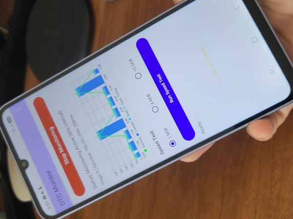
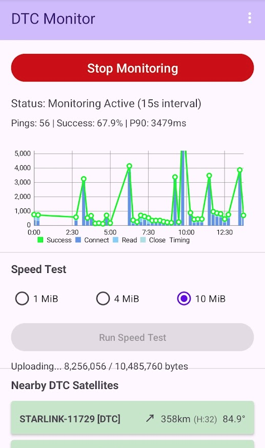
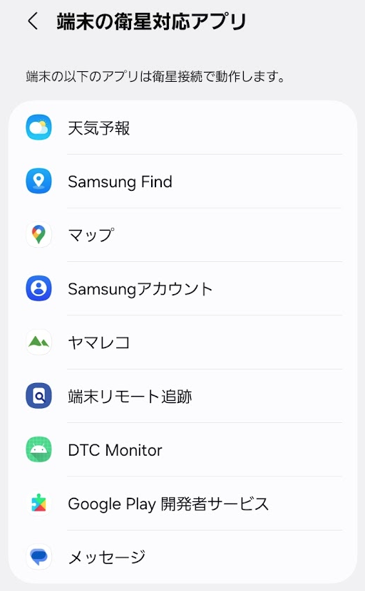
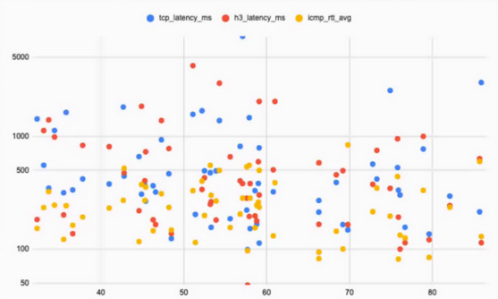
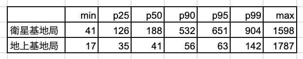

# 衛星データ通信対応のスマホを入手したので圏外でデータ通信してきた

こんにちは。本エントリは「au Starlink DirectでDTC」アドベントカレンダー2025の4日目の記事です。
昨日は [au Starlink Directの27ヶ月間振り返り](https://github.com/muojp/ac2025/blob/main/03.md)でした。

## いっぱいスマホを持ってるのに衛星データ通信用のスマホがないときは

買いましょう。

11月中旬、Galaxy A25 5Gという端末を購入しました。

わざわざ専用端末を買わなくても手元にあるスマホが人工衛星につながるのがDTCの良いところのはずなのですが、なぜかau Starlink Direct用に購入した今年2台目のスマホです。

au Starlink DirectをはじめとするDTCサービスで実際に衛星直接接続のデータ通信を利用するためには、端末のハードウェア的な対応とOSのサポート、通信キャリア（接続情報）のサポートという3つの壁を突破する必要があります。
とくにAndroidにおいてはAndroid 16が必須要件かつ最大のハードルです。

今年の5月から手元でau Starlink DirectでのSMS/RCS動作検証に利用していたXiaomi Redmi 12 5Gは、残念ながらOSバージョンの壁を超えられず衛星データ通信非対応端末となってしまいました。

いっぽう、11月下旬のサポート端末更新でかなり多くの端末が衛星データ通信に対応しました。
これらのなかで現状最安の端末を検証用に購入しました。

Galaxy A25 5GはMediaTek Dimensity 6100+ SoC搭載のエントリーモデルで、キャリアと契約体系によってはほぼタダで配布している端末です。
新品購入しても15,000円ほどでした。さすがに衛星データ通信実験のためだけに15万円前後のスマホを購入するのはためらっていたのですがこの価格なら手を出しやすいです。

## 圏外でデータ通信してきた

さて、Galaxy A25 5Gが11月26日に衛星データ通信対応したので圏外までデータを取りに行きました。

この結果の概要は[DroidKaigi.collect { #29@Tokyo }](https://droidkaigi.connpass.com/event/375731/)でシェアしたものです。
資料はこちら：[au Starlink Directで衛星直接データ通信](https://docs.google.com/presentation/d/1pFI23VqWniDuuvj8RY0zyw5TldOL2y_Q4VeiXG2RVuY/edit?usp=sharing)

### 準備: 通信用アプリを作る

Android 16の衛星ネットワークサポートにおいて、DTC対応をAndroidManifest.xmlで明示したアプリ以外はDTC衛星環境で通信できないというのが重要なポイントです。

Androidには各種ネットワークテストアプリやLinux風のシェルを提供するアプリ、それに最新のPixel環境であればLinuxエミュレーター環境もありますがこれらがDTCをサポートしていない以上は衛星データ通信環境では利用できません。

このため、衛星データ通信環境の検証用に「DTC Monitor」というアプリを開発して臨みました。

DTC Monitorに実装した機能は
- ネットワーク遅延計測
- データダウンロード・アップロード速度計測
- 自分の近くにいるStarlink DTC衛星の距離と方角・仰角表示

です。

衛星ネットワークをサポートするAndroid 16上でシステム設定メニューから前述の衛星対応アプリ一覧ページを開くと、ちゃんとサポートアプリ一覧画面に載ります。

今回はネットワーク遅延計測について紹介します。
得られた情報の整理や分析がまだ終わっていないので、データダウンロード・アップロード速度の計測についてはまた機会を改めます。

### ネットワーク遅延計測手法

DTC Monitorにはいわゆるping類の実装を3種類用意してあるのですが、Androidスマホ上で完結して実行する都合上いくつか制限もあるためまず概要を紹介します。

#### TCP ping: TCPでのconnectとその直後にserverから送出するレスポンスを読み出す
- TCPはping実行の都度接続している
- 常にパケット2往復
- パケットロスにより再送が入ったらさらに往復回数が増える

#### HTTP/3 ping: HTTP/3でのリクエスト実行
- Android+CronetでのHTTP/3処理
- 内部でHTTP/3セッションが保持されるケースがある
  - 接続保持されたら最短パケット1往復（のはず）
  - 新規接続になったらパケット3往復
  - パケットロスにより再送が入ったらさらに往復回数が増える

HTTP/3 pingについて詳しく検討し始めるとかなり長くなるので機会を改めます。
ひとまず、HTTP/3の仕様上とても気になるであろうConnection Migrationは衛星間の回線移動時にも効いてそうな挙動をしていた、ということだけ付記しておきます。

#### ICMP ping
- これはAndroid端末にプリインされているpingバイナリをそのまま使って出力をparseしています
- Android 6.0以降ではLinuxの機能を使ってroot権限なしでICMP echoパケットを生成・reply取得できる（[icmp4a](https://github.com/marsounjan/icmp4a)がこれをやっています）のですがプリインバイナリ利用のほうが手っ取り早かったです
- いわゆる普通のpingであり、送受信失敗時でも再送をしないのでパケットは常に1往復です

## 衛星直接接続環境のデータ通信遅延

12月某日、実際に圏外で衛星データ通信をしてきましたので結果をシェアします。

ネットワークの特性を把握するための情報としてはネットワーク遅延、応答時間のばらつき（ジッター）、パケットのロス率、スループットとさまざまな視点があります。衛星コンステレーションによるインターネットアクセス環境の場合には端末と衛星の位置関係も重要な要素です。

しかしこれら全てを一気に分析・紹介するのはちょっと要素が多すぎるので、まずは遅延とジッターとロス率に注目します。

### レイテンシーの可視化

まず散布図を示します。

これは、近隣で最も仰角の高い衛星の仰角を横軸に置き左ほど仰角の低いもの、右ほど仰角の高いもの、そして縦軸に各種pingのレイテンシーをマッピングしたものです。

TCP pingが青、HTTP/3 pingが赤、ICMP pingが黄色です。

衛星の仰角が低いほど見通し障害物による通信への悪影響が出てくるのに加えて、仰角80度付近の衛星と仰角30度付近の衛星では通信距離もざっくり2倍近く違ってくるので、直感的には「仰角が大きいほどレイテンシーは小さくなる」と想像できます。
とくにスマホ端末から衛星へのアップリンク側の電波が届きやすい効果を期待できます。

しかし実際の結果を読み解いてみると、ICMP pingが最も条件が良いので短時間で完了する傾向は見えますが、ここで重要なのは「横軸が右に行くほどレイテンシーが小さくなる」わけではない、ということです。
仰角の推測値（非公式情報の処理結果）が正しいか否かという点も含めて考慮は必要ですが、これは別の機会に検討します。

厳密には上りタイミングと下りタイミングを分けて計測する必要がありそうですが、これも一筋縄ではいきません。
Android端末の時計がミリ秒単位で正確に調整されていればなんとかなるのですが実際には普通に100ミリ秒ほどのズレが許容されているためで、詳しくは別の機会に紹介します。

### 通信遅延のばらつきを数値で掴む

通信遅延のばらつきを把握するため、さきの散布図に含まれるICMP pingのデータを加工してp25/p50/p90/p95/p99の値を得ました。
単位はいずれもミリ秒です。

これにより結果を言語化しやすくなります。

- 最短で結果を得られたものから数えて全体の25%までは地上基地局の4G/5Gと遜色のない結果
- 最短結果から数えて全体の50%ぐらいまではまだまだ善戦している
- しかし全体の90%が戻ってくるまでの時間はかなり伸びて往復約500ミリ秒、地上基地局環境と比較するとかなり悪い

ざっとこんな感じでしょうか。

### ロス率

近隣に衛星がないタイミングを除く、DTC衛星と通信できるはずのタイミングに絞ってICMP pingのロス率をチェックしたところ9%ほどパケットロス（pingタイムアウト）していました。

## まとめ

au Starlink DirectでのDTCデータ通信のパフォーマンスを計測しました。

わかったことは次の通りです。
一般的な衛星データ通信について想像される通りの内容も多いですが、意外な結果もありました。

- レイテンシーが大きい
  - 50パーセンタイルまでは往復200ms未満なのでだいぶ良好
  - 実用上気になる90パーセンタイルで見ると500msを超えてくる
- パケットロス率が高い
  - 衛星通信の状況が良いタイミングに絞っても9%ほどロスしている
- 最近隣衛星への仰角と通信レイテンシー傾向には明確な関連なし

データはもう少し整理して公開しますが、今回はかいつまんで計測結果をシェアしました。

明日の担当はmuoさんです。
